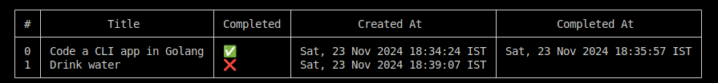

# ✨ Todo CLI

A sleek and efficient command-line todo list application built with Go that helps you stay organized and productive! 🚀



## 🎯 Features

- Create and manage todos with ease
- Toggle completion status
- Edit existing todos
- Remove completed tasks
- List all your todos in a beautiful format

## 💻 Usage Examples

```bash
go run . -list
go run . -add="Buy groceries"
go run . -edit="1:Buy milk"
go run . -del=1
go run . -toggle=1
```
